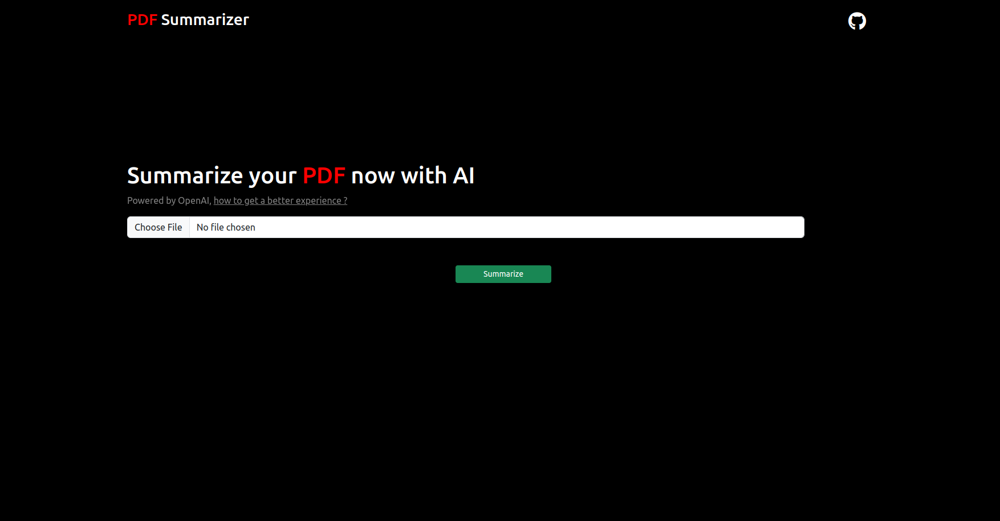
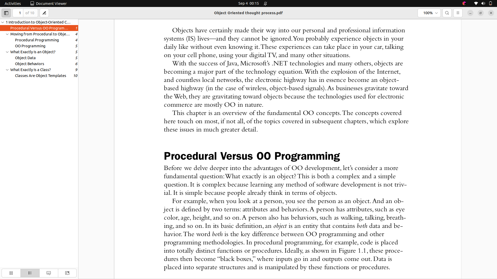
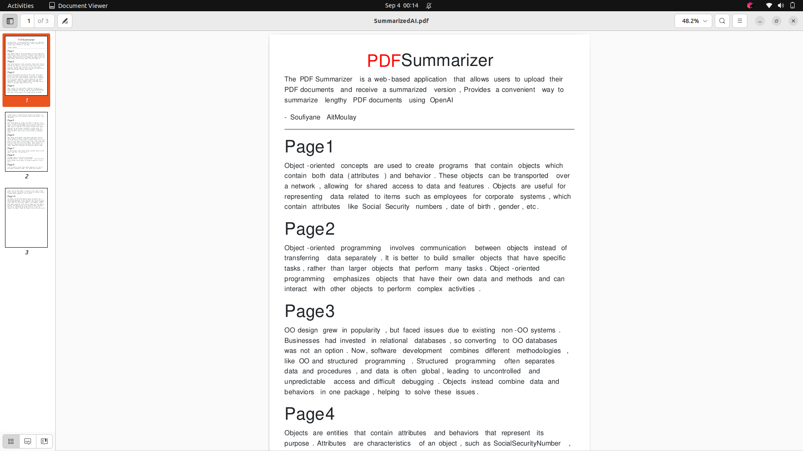

# PDF Summarizer 
The PDF Summarizer is a web-based application that allows users to upload their PDF documents and receive a summarized version, Provides a convenient way to summarize lengthy PDF documents using OpenAI

## Installation
To start, you need to install npm dependencies
```bash
npm install
```

Next, start our server.
```bash
node openaiAPI
```
If everything went well, grab your api key and add it to .env file and start uploading you pdf to the app

# Screenshots

### demonstration
I will be testing for example this pdf and try to get the summarized version of it

## result


